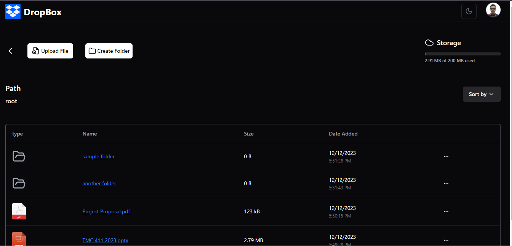

# Dropbox Clone

 Dropbox Clone  is a web application that  allows for file uploads and folder creation, it provides a neat table to view all your data.

## Reason
I wanted to practice working with tools such as Shadcn UI, React Dropzone and Firebase.

**Note: The application is limited to only 5 users with a ```200 MB``` storage limit**

**Why?** 
I am using firebase storage free tier and my application is limited to ``1GB`` free storage and ``200MB`` for 5 user's seems like a fair-trade to me.
## Screenshots

### Home Page
### Dark
 
### Light

### Authentication Page
### Dark

### Light

### Dashboard Page
### Dark

### Light


## Tools

### Frontend
- React
- React Router
- Shadcn UI
- Typescript
- Context Api
- Lucide React

### Backend

- Firebase Authentication
- Firestore
- Firebase Storage

## Features
1. File Upload  through a drag n drop interface.
2. User Authentication (Google Authentication)
3. User Dashboard that contains an interactive data table
4. Light mode and Dark Mode.
5. CRUD operations on files and folders.
6. Folder Paths for easy folder navigation.

### Deployment


## Getting Started
 The project was built with React, Typescript,vite.

### Prerequisites 
 you will need to ensure that you have node js installed

To check if you have node installed run:

```git 
    $ node -v
```

if you don't have node js installed get it here.

### Installation

- [ ] Clone the Repository  
```
    $ git clone https://github.com/nathan-somto/Dropbox-Clone.git
```

- [ ] Enter into the directory

```
    $ cd Dropbox-Clone
```

- [ ] Install all dependencies

```
   $ npm install
```

- [ ]  Start the Development Server

```
    $ npm run dev
```